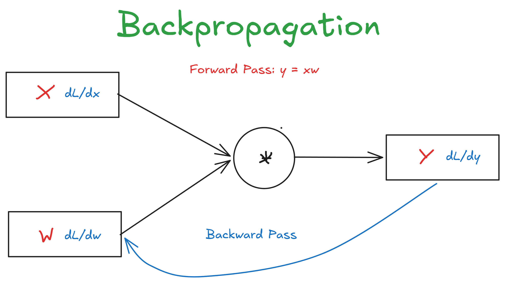
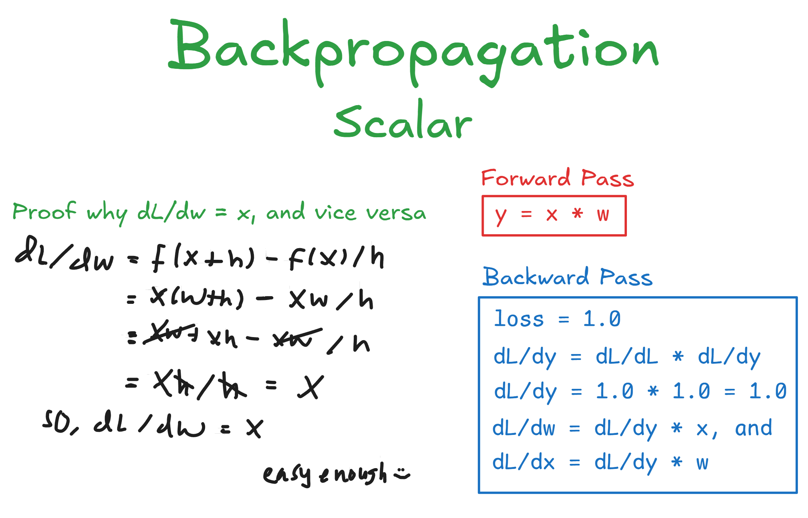
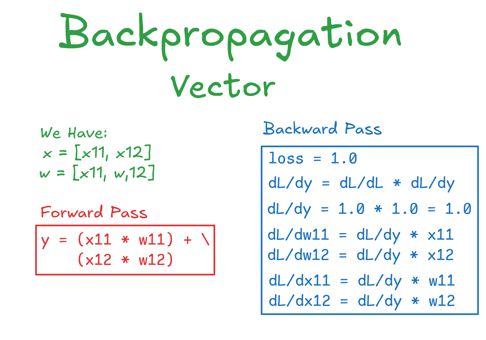
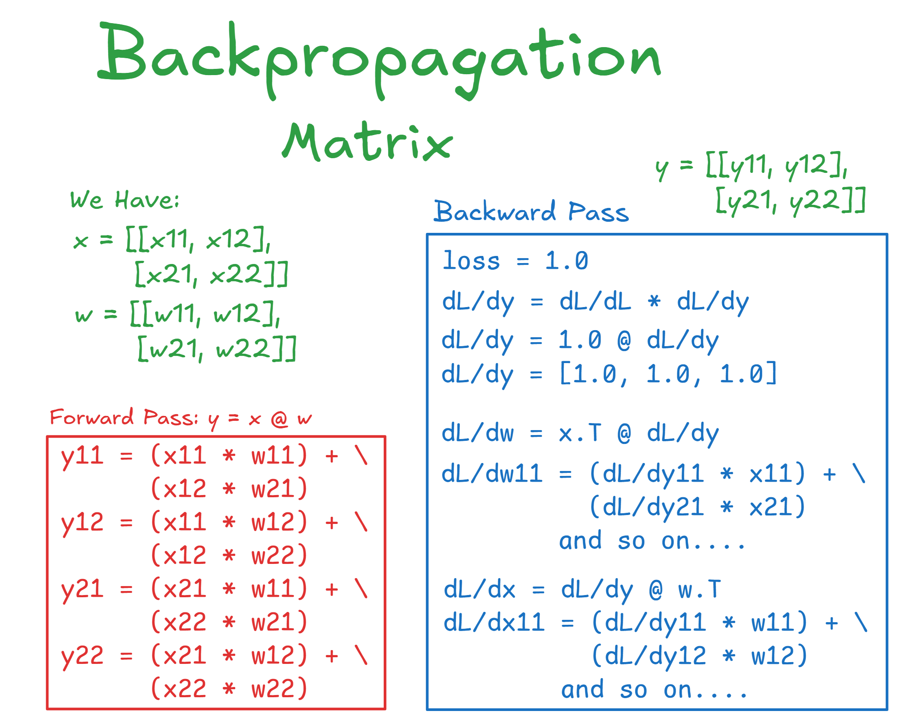

# Backpropagation



as the name, Backpropagation it means go back into first layer while computing the gradient for each weight in layer

## Why We Need Backpropagation? 

because we know step backpropagation it after forward pagation, so in training model will predict distribution of label and each predicted will produce error and the larger error the stupid model (not learn yet), but we can't predict correctly if we just forward pagation, Intuively we want the model learn from model mistake (error) and that's why we need backpropagation

## What is Gradient?

Gradient is the compass for weight in reaching the minimize loss point, so we know if the loss larger the gradient become large it's meant changing the weight in opposite direction can reduce the loss or the same meaning how sensitive loss towards weight

## How We Do Backpropagation?

To do backpropagation we must know how to calculate gradient for each weight and the with method Chain-Rule if dealing with Multi-Layer Network
> *Chail-Rule is method of calculus for compute derivatives from function that has many-layered, in Neural Network, Chain-Rule used to compute Gradient in a chain from right layer (loss) to left layer (first layer) in a way multply Local Gradient and Upstream Gradient (Global) that will use for changing the weight*    
For simplicity we just use small approach it is **y = w * b** (Forward Pass) and **dL/{dw,dx} = dL/dy * dy/{dw,dx}** (Backward Pass)

### Scalar

Oke, this is the way to compute gradient in scalar shape, because we know forward pass is *y = w * b*, then the derivatives of each variable is this:
```
loss = 1.0  # because sensitivity loss towards loss is 1.0

dL/dy = dL/dL * dL/dy
# for instance grad local of y is = 1.0, then
dL/dy = 1.0 * 1.0

# calculate gradient for x and w
dL/dw = dL/dy * dy/dw
# the derivatives of multiple sign is the opposite multiply
# this is proof:
# f(x*h) - f(x)/h
# ((w + h)*x - (w * x))/(w * h) - w
# ((w*x)+(h*x)-(w*x))/h
# (h*x)/h
# x
dL/dw = 1.0 * x
vice versa
dL/dx = dL/dy * dy/dx
dL/dx = 1.0 * w
```



### Vector

For derivatives it's the same, it's just that in shape vector (1 x N) or (N x 1)    
```
x = [x1, x2, x3]
w = [w1, w2, w3]

dL/dy = 1.0 # we just use the same grad at scalar section
# we know to get y:
# y = (x1 * w1) + (x2 * w2) + (x3 * w3)
# Intuively actually it's same with scalar
dL/dw1 = dL/dy * dy/dw1
dL/dw1 = 1.0 * x1 # and so on with x2,x3, till xn if exists
vice versa
dL/dx1 = dL/dy* dy/dx1
dL/dx1 = 1.0 * w1 # and so on with w2,w3, till wn if exists
```



### Matrix

Oke this one slightly different than previous such as scalar and vector, because we know to get y we multiply matrix by matrix it's call matrix multiplication (matmul), oke let's we compute   
```
x = [[x11, x12], [x21, x22]]
w = [[w11, w12], [w21, w22]]
# we know to to get y it's from x @ w.T
# so, shape of y it's x:(B, D) @ w:(D, F) = y:(B, F)
# for simplicity we call
y = [[g11, g12], [g21, g22]]

# get derivatives of w
# we must transpose x 
x.T = [[x11, x21], [x12, x22]]
# then,
dL/dw = dL/dy * dL/dw
dL/dw = x.T @ dL/dy
# why, we need x for first place, see Figure 4
# and for x
dL/dx = dL/dy * dL/dx
dL/dx = dL/dy @ w.T
# we don't need w first place for x 
```



## Conclusion   
So backpropagation is how we compute gradient for each weight in layer so that we can reduce loss and make model become smart, hehe thanks >.<