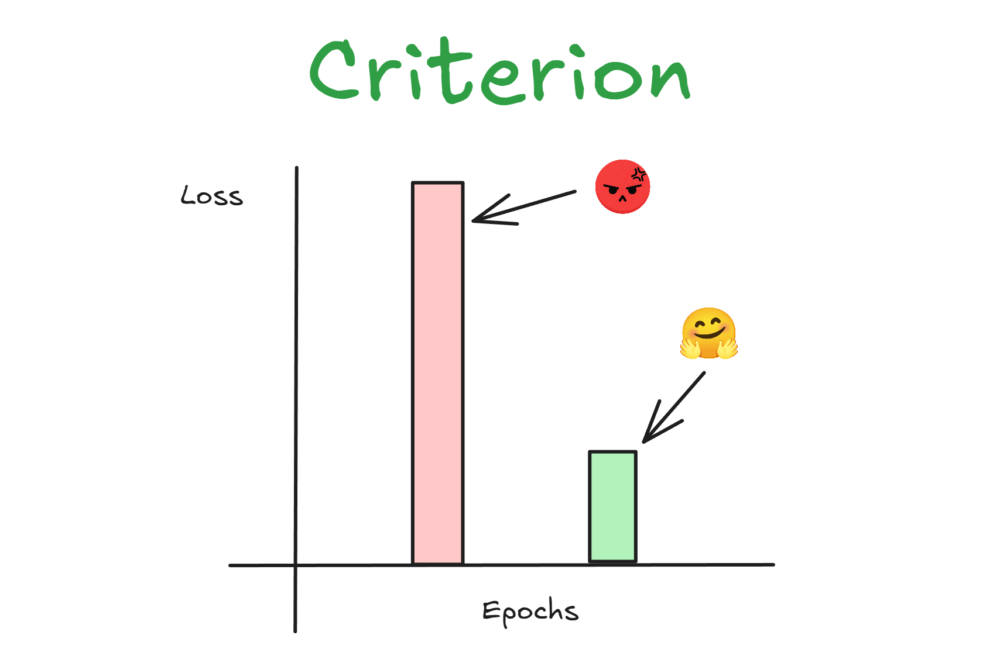
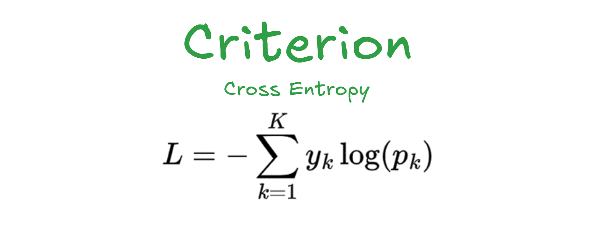
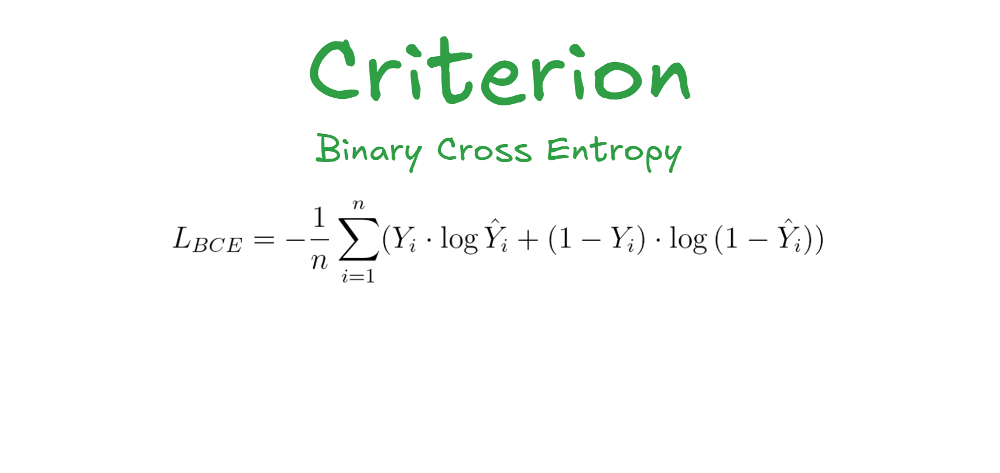
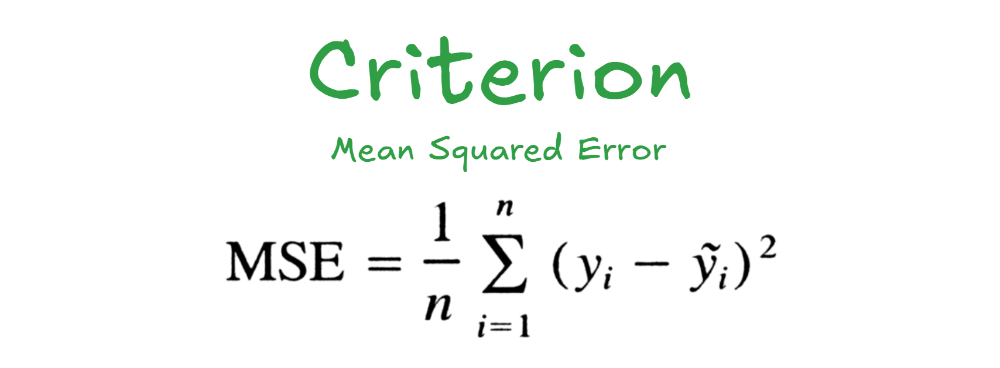

# Criterion

Criterion is loss function that use to measure how bigger mistake or error model on target
large error denotes model not yet learn distribution of target, the more smaller error it's meant
model become good to predict distribution of target, the goals is look for error become smallest



## Types of Criterion

### 1. CrossEntropy   
Be used when model predicting categorical class such as {dog, cat, fish}, {positive, neutral, negative}, etc.  



For example:    
```
Data 1: Target "sleep"
P("eat") = 0.1
P("sleep") = 0.7
P("study") = 0.2
Loss1 = -log(0.7) = -(-0.35) = 0.35

Data 2: Target "study"
P("eat") = 0.6
P("sleep") = 0.3
P("study") = 0.1
Loss2 = -log(0.1) = -(-2.30) = 2.30

Total CE = (0.35 + 2.30) / 2 = 1.32 
```     
> *Note: lookup to label index and get probs for index it*

### 2. BinaryCrossEntropy     
Be used when model predicting binary class such as 1 or 0, spam or not spam, yes or no, etc.  



Denotes:    
```python
if target == 1:
    loss = -log(y_hat)
elif target == 0:
    loss = -log(1 - y_hat)
```

For example
```
Data 1: Target = 1, Pred = 0.8
Loss1 = -(1 * log(0.8)) + (1 - 1) * log(1 - 0.8)
Loss1 = -(1 * log(0.8)) = -log(0.8) = -(-0.22) = 0.22

Data 2: Target = 0, Pred = 0.7
Loss2 = -(0 * log(0.7)) + (1 - 0) * log(1 - 0.7)
Loss2 = -(1 - log(0.7)) = -log(0.3) = -(-1.20) = 1.20

Total BCE = (0.22) + (1.28) / 2 = 0.71
```

### 3. MeanSquaredError     
Be used when model predicting continu number such as house prices, height, weight, etc.



```
Data 1: y = 10, y_hat = 8
Loss1 = (10 - 8)^2 = 4
Data 2: y = 5, y_hat = 5
Loss2 = (5 - 5)^2 = 0

Total MSE = (4 + 0) / 2 = 2
```

## Conclusion   
Loss showing on us how good model in prediction distribution label, loss high = not good, loss low = it's good, yayy >.<.
