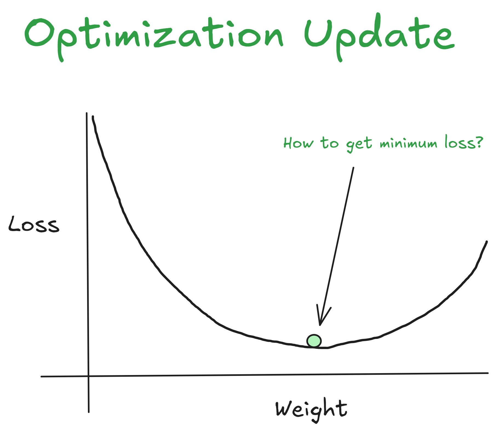
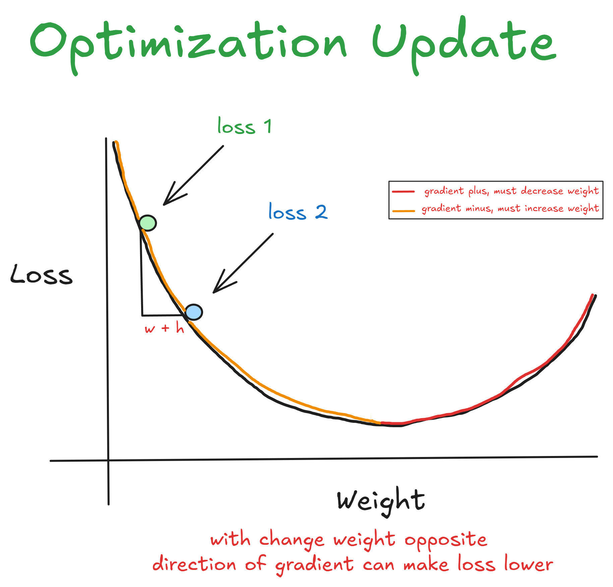
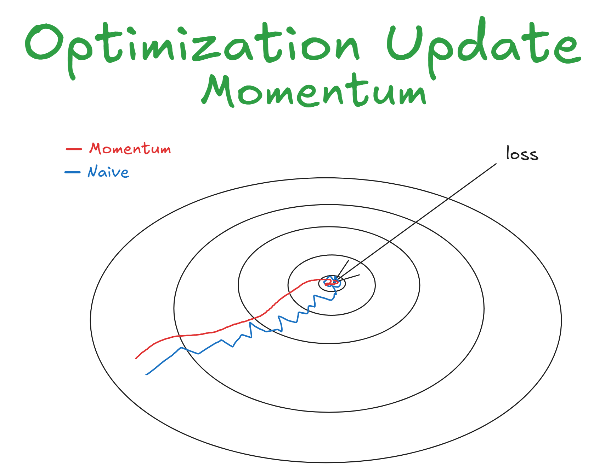
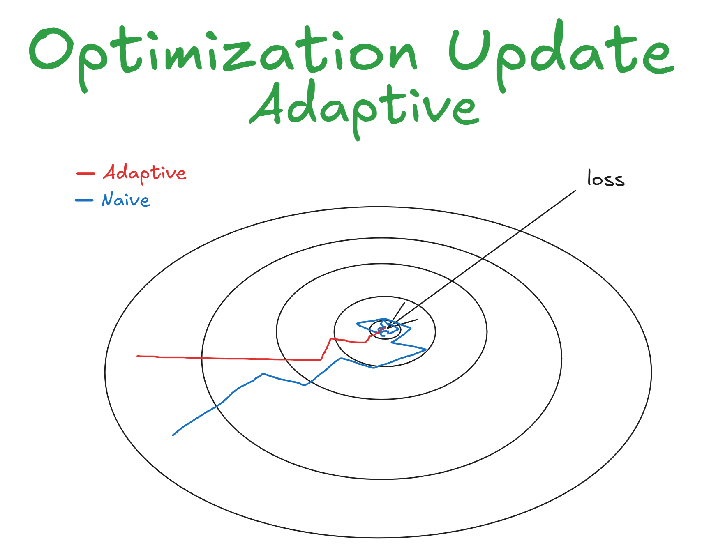
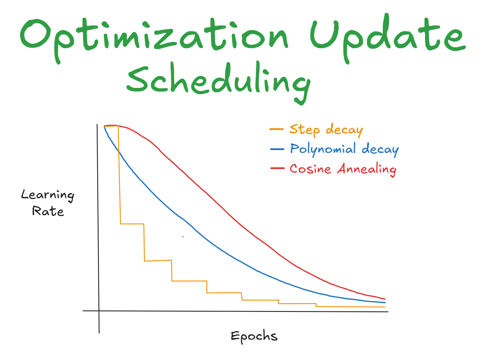

# Optimization Update

Optimization update is update the weight corresponding with direction of Gradient, this is final step from Backpropagation after compute the gradient we update weight based on gradient

## Why We Need Update?



As we know if model predict it will produce error, and the larger error the larger loss we get, and if the loss get higher it's meant the model doesn't enough to predict corresponding distribution of label, and we want to update the weight of model so that in the next iteration we can get better prediction more and more

## How We Update The Weight?

We know each weight have the gradient, and with gradient we know how sensitive loss change if we change this weight slightly and this method called ***Gradient Descent***.

this equation to update weight  
```
W_new = W_old - (learning_rate * gradient_weight)
```

For example:    
```
x = 2
w = 5
loss = x * w = 2 * 5 = 10

# Update
w = w - (learning_rate * gradient_weight)
w = 5 - (0.001 * 2)
w = 5 - 0.002 = 4.998

# next iteration
loss = x * w = 2 * 4.998 = 9.996
```



We know adjust the weight to opposite direction of the Gradient can reduce loss, it's meant if the gradient is positive then decrease the weight can reduce the loss, in contrast if gradient negative then increase the weight can reduce the loss, to get more intuition see *Figure 2*

## Parameter

At equation earlier we know the optimization have parameter to update the weight, this is any parameter of update the weight:

**1. Learning Rate**: As the name, learning rate it's meant how many we change the weight towards the gradient so we can reach minimum loss, if the learning_rate high the more change weight and faster to reach minimum loss but more higher learning rate will occur oscillation and model even never reach minimum loss and the smaller learning rate can prevent oscilattion but to reach the minimum loss need many iteration and make model to take longer to convergen, choose the right learning rate can affect performa of model    
**2. Momentum**: Maybe this thing is new, but in classic gradient descent we just move based on gradient, if gradient positive we decrease the weight and vice versa, but turns out it make the model become volatile, make model to take longer to convergen, and have a risk trapped into saddle point    



**3. Adaptive**: This one also the new thing of Gradient Descent, Adaptive it's mean adjust the learning rate based on history gradient, why we need this? if the gradient is large and the learning rate smaller to get minimum loss take more time and because adaptive adjust the weight based on history gradient we no longer afraid between choose higher lr or lower lr     



**4. Scheduling**: This is not parameter more towards techniques of decay learning rate from iteration to iteration, because for first iter we know the model loss become larger we want learning rate higher so that model can learn faster and the longer iteration decreasing loss we want small learning rate because we know we almost get minimum loss, and to get this one we need scheduling learning rate, there are many scheduling learning rate such as one of my favorite Annealing Scheduling   

   

## Type of Optimizers

1. Adam (Adaptive Momentum Estimation) -> This use method hybrid that is Momentum and Adaptive (EMA)    
2. RMSProp (Root Mean Square Propagation) -> This use method Adaptive (just see accumulative prev grad and now theyre use Exponential Moving Average (EMA) the longer gradient the more faded (decay))     
3. AdaGrad (Adaptive Gradient) -> This use method Adaptive (accumulate gradient from first iter till last iter)     
4. NAG (Nesterov Accelerated Gradient) -> This use method Momentum (peek the future before update the weight)        

## Conclusion   
So, Optimization Update how is reduce the loss by change the parameter, thanks >.<