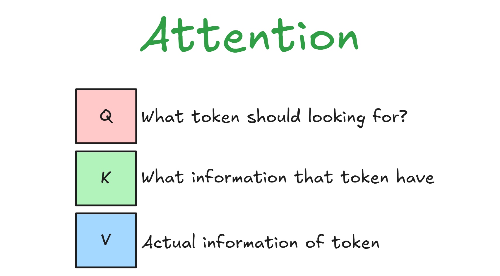
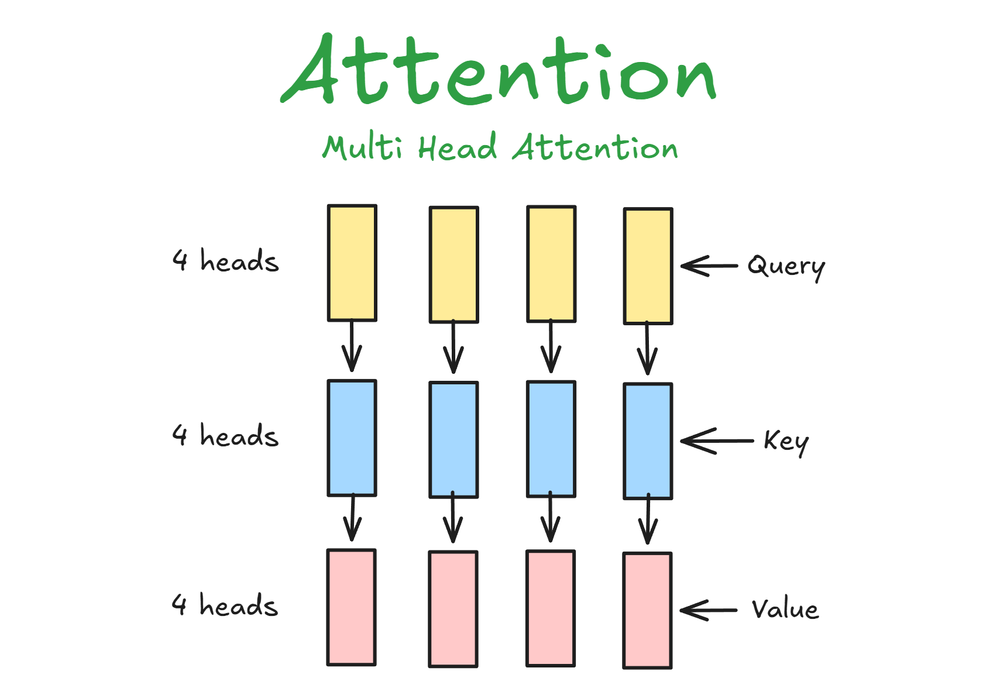
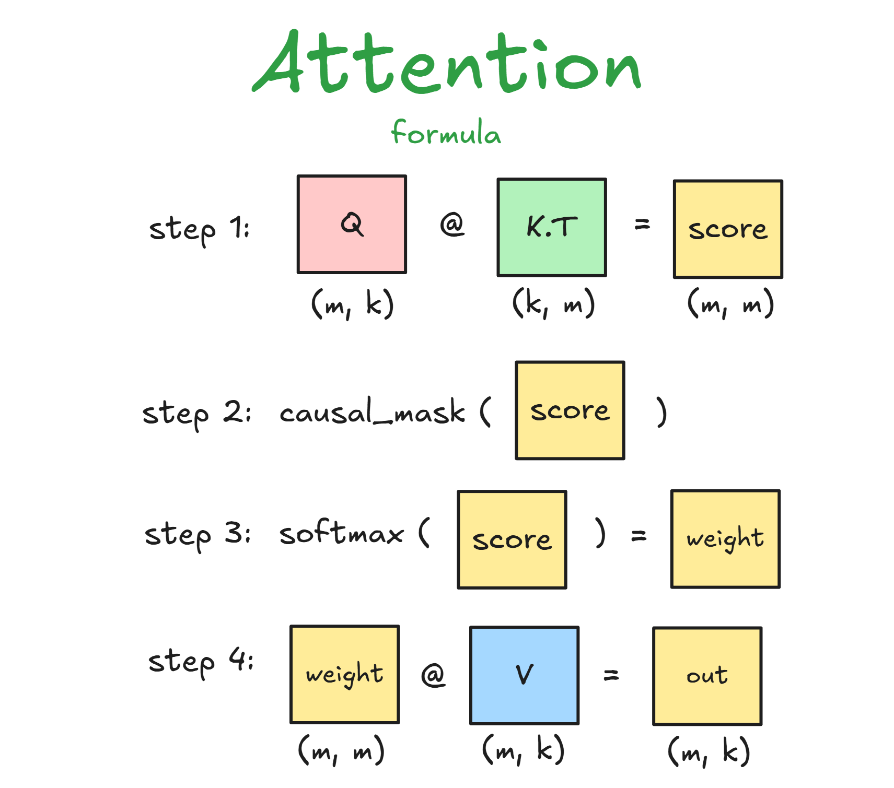
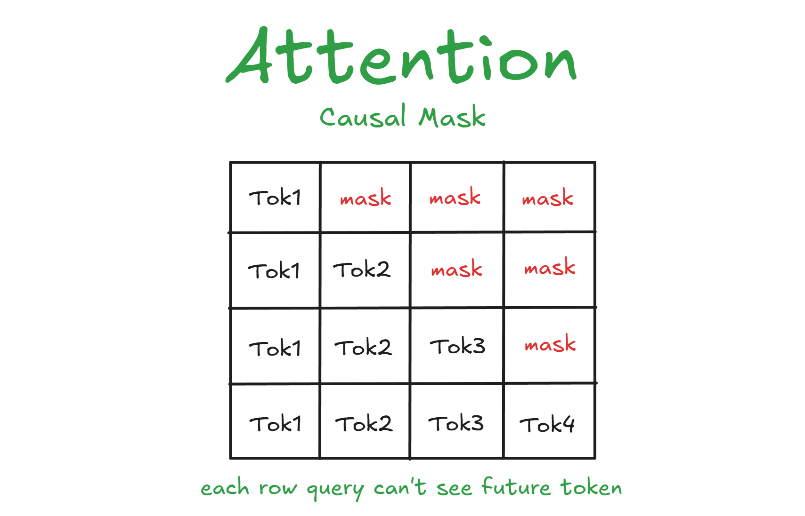
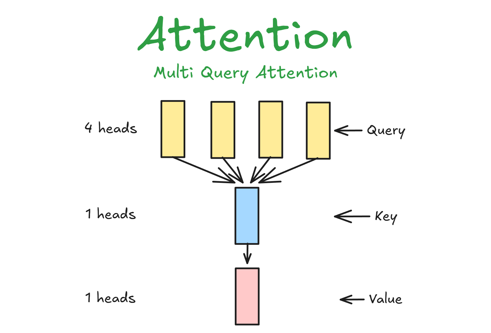
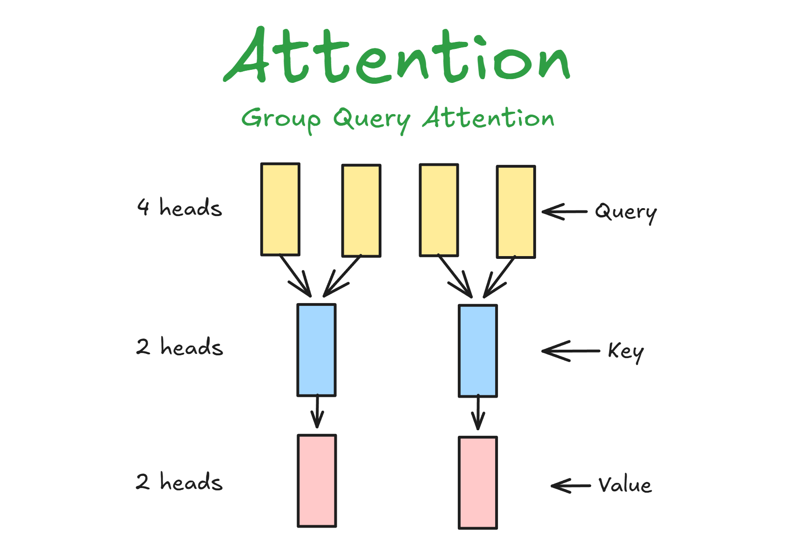
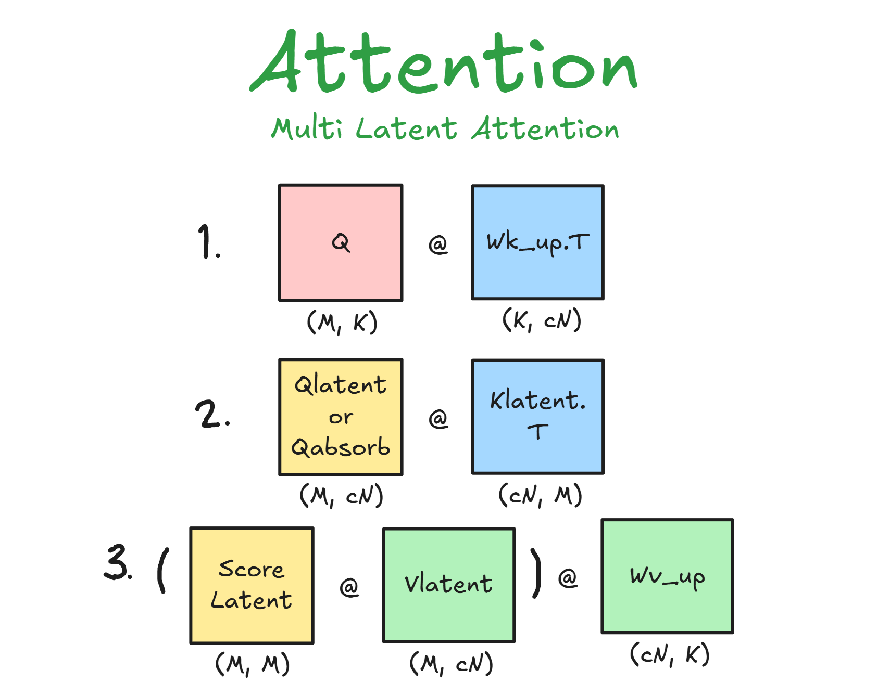

# Attention

Attention is mechanism which each token see other token to get information that used to predict next token, Intuively each token query attend to all token key and in the end will given real token value   



Q denotes what token have to looking for    
K denotes what information that have contains   
V denotes real information or actual semantic of token, like "if you want me, then here i am"   

## Why Attention Exists?



So, used to be algorithm for Sequential Input like Natural Languange Processing is RNN (Recurrent Neural Network), because RNN have problems towards long-term memory LSTM exists version powerfull than one but the algorithm still have the same issue that's amnesia (the more length token grow previous token become faded slowly) and vanishing gradient every time dealing with long sequence and also this algorithm running sequential which is we can't doing parallel and make training be longer, that's why Attention exists to solve the problem about long-term memory because each each token directly attend to each token and also can running by parallel the model can be scale up to be larger and fit with GPU mechanism nowadays, this is why SOTA LLM use Attention mechanism 

## How To Calculate Attention?  

Oke, since we know essence of attention, we also know how to compute this algorithm.
this is how the way compute Attention

We have matrix Q, K, V each matrix contains token-token
Formula:



Before we diving deeper, we must know new things that there's in attention mechanism
- Causal Mask, what causal mask? causal mask is technique masking the future token so that token can't see the future, we need this in model Autoregressive that have to predict next token



- Softmax, this is activation function that change affinity or scores into probability (range 0 - 1), if Qi @ Ki have high probability then token K means so much for Q or high correlation or semantic alignment or contextual affinity

For example
```
Q = [[2, 3],[4,1]], K.T = [[1,2],[3,4]], V = [[3,2],[5,2]], sqrt(2)
scores = Q @ K.T / sqrt(dim)
scores = [[11, 16],[7,12]] / sqrt(2)
scores = [[7.77817459, 11.31370850], [4.94974747,  8.48528137]]
weight = softmax(scores)
weight = [[0.028318, 0.971682],  [0.028318, 0.971682]]
output = weight @ V
output = [[4.943364, 2.0],[4.943364, 2.0]]
```     
> *Note: not use causal mask because matrix so small, if want see mechanism of causal see Figure 4*

## Limitations  

Even though attention so powerfull, we always dealing with problem like we solve the problem but we create new problem, here is problem of Attention:   
1. Quadratic Complexity, we know attention attending each token, this is make compute become Quadratic Complexity O(n^2) because we must at least each token see other token once time, so that's why algorithm optimization like FlashAttention exists.    
2. Positional Encoding, we dealing with sequence data therefore we need model know the position each know, since attention it's parallel mechanism model become blind order, so we need positional encoding so that model know order each token, "Sleepy one" == "one Sleepy" because this is produce same score dot product that's why we need add information positional  
3. Black Box, hard to interpret because we don't know exactly meaning in combinations attention cause after process in many layers, many heads so hard to translate certainly by Human, so this is make debugging not exactly precision when occur bias or hallucination in model we just can assume why model like that but we don't know exactly where model become bias or hallucination 

## Types of Attention

This is types of attention where can solve problem KV-cache memory  
> *KV-Cache is techniques save activations K and V into memory VRAM, so in phase decode model no longer compute NxN but 1xN just compute new query from result previous prediction*     
so we know KV-Cache must be allocate to memory, the more sequence length the more need VRAM and KV-Cache VRAM growing linearly because each time process decode will adding at least one token over time, so this is types of attention:    
1. MultiQueryAttention, this is mechanism where each heads just see one heads KV and reduce a lot memory of KV-Cache but the tradeoff make model inaccurate and chaos, perplexity become large



2. GroupQueryAttention, this is solve MQA that naively use one heads, GQA is where each heads see group KV heads this is reduce memory usage from KV-Cache but not as many as MQA then still preserve accuracy model, if group kv size = 1 it's the same like MQA and if group kv size = n_heads it's the same like MHA, so intuively GQA take action along them    




3. MultiLatentAttention, this is mechanism where reduce KV into small dimension instead of still preserve KV in higher dimension, why this is make sense? because we know KV is bunch of vector and at least many vector redundant or for simplicity useless vector, the motivations why we dont take important vector by compressing into lower dimension, so that's why MLA reduce dimension KV and force the model to learn how to keep information but in lower dimension (effect of down projection) 



## Conclusion       
So, Attention is mechanism which token attend to other token to get information that could have predict next token correctly